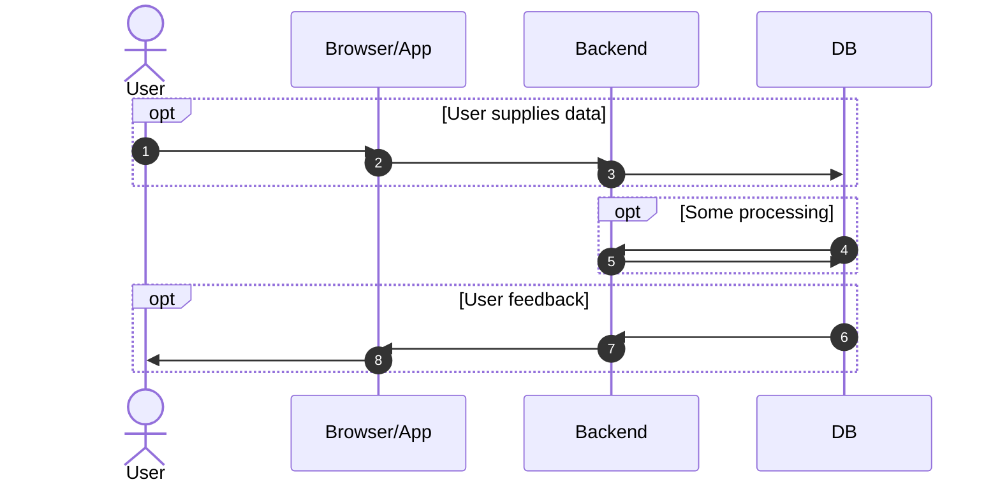

# The long story of the test structure Testaco tries to support
## A small user story

All the systems I have created through decades of development have been variations on a simple theme.
There is some kind of user, there is usually some kind of persistence, and there is some kind of data
processing going on between the user and the data store.

    This section will distil systems of hundreds of thousands of lines of code into one diagram. 
    It is going to seem very simple, and Testaco will therefore feel overly complex for such 
    a simple system. Please keep this in mind if you feel the complexity gets too much.
    The underlying goal is to reduce system or maintenance complexity, not add to it.

In this diagram there is a user, who exhibits some behaviour and has some expectations. He interacts with some kind of
input device - a mobile phone, a web app, something. The interactions in sequence 1 and 8 in the above diagram is
within the realm of UX. I have never really found a way to automate UX testing. We will leave these bits on the
side for now as untestable.

The GUI has some kind of forms or controls the user can interact with. Interacting with frontends such as this was
within the realm of  Selenium way back when, nowadays there are tools like 
[Playwright](https://playwright.dev/). Tests interacting
with the GUI are notoriously brittle if not written in the right way, so many people skimp on this kind of testing.

I have very little skill in app testing, but I suspect similar tools exist within this realm. 

## A simplistic test strategy

What we often do is to test "the functionality", meaning the code we wrote ourselves. We trust the library vendors
to write something that works, otherwise we should not have chosen the library in the first place?

We write unit tests, and many
teams never actually exercise sequence 3 in the above diagram to interact with a database, or they interact with a
different database engine than they use in production because of licensing issues or whatever. Some really unlucky
people have their functionality embedded in stored procedures, which means they lack two decades worth of test tooling
in their technology stack, which means their automated tests are problably not all that good. But let us say we have
avoided all of those pitfalls, because Testaco can not help you with those.

So our unit test, which exercise "our" code, runs, and test what we have defined to be our business rules. And then
some vulnerability comes along and gets fixed in a library, or there is a new release we want to upgrade to. None of our
tests will actually send the data from the browser, into an assembled system, and then on to the database. We don't know
whether the system still works because the tests only exercise our own code. The libraries are a blind spot which plops
us back into manual poke-it-and-hope testing. Anyone who has had to upgrade libraries in a system with this kind of test
strategy has felt the pain. This is where the long lists of unpatched libraries start to appear. Poking aimlessly at
an application for some hopefully nonfunctional change is not much fun.

    How did you react to this rant? Did you become defensive? Did you reject the idea already?

    If you did, it might be useful to do some exercises with your team.
    - is it ok to question stuff in your team? Do people feel comfortable doing so? How can you get a straight answer?
    - ideas can be presented problem-first or solution-first. Are both variants ok in your team?
    - if ideas are rejected, will the proposer get a nonconfrontational reason? If not, the flow of ideas will dry out.
    - is it ok for all members on your team or qualified outsiders to provide ideas?

    If you could not answer "yes" to all these questions you might want to look into that before trying out Testaco

## The first and biggest improvement: Drive a spike through the system

To handle this problem it is obvious to me that the easiest first step is to model interaction 2 and 3 in at least
one end-to-end test. Pull all the bits together, use something like Playwright to do what the user would have done,
and then use something like Testaco to verify what ends up in the database is what you expected.

If your json library starts serializing stuff differently, you will notice, which is the whole point.

This will buy new problems, to do with the maintenance of the data sets. Testaco is built to start off loading a minimal,
static data set (this is where the configuration for your system goes), and then a test-specific data set containing a handful
of rows representing the interaction with the user. This handful of rows starts out empty, you as the developer push
the GUI buttons on behalf of the user, run the test, and Testaco will spit out the dataset it sees for your
manual inspection. Once you are happy with the data, just put it into the reference data set for the test, and you are done.

Likewise interaction 4-5 in the above sequence diagram would get its own test, and so would interaction 6-7. These tests
will often run off data created in tests created by the user-inputs-data-tests.

Maintenance of the data sets as the database schema changes over time is automated. Testaco will tell you how when
the database schema changes.

## What just happened to the system?

The spike therapy just applied has made a major change to how your system behaves. You have gained some overhead through
the new test platform and maintenance of some new tests, for sure.

Another thing has happened, too. The spikes interacts with the user interface and the database - but does not
directly care about the boundaries of the units within the system. This is a major bonus when you end up having 
to refactor your code. Any nontrivial refactoring
will change some kind of boundary. If you only have fine-grained unit tests you are probably not going to get much
support from your unit tests as you change the boundaries of your fine-grained units.

Having the safety net of knowing that the system behaves at least somewhat the same after your remolding of a unit is
a huge benefit.

## The next natural step

You have now got a running system in a test rig. You can poke and prod that system to also test negative test cases. Have you got
a test that tries to log in with an existing user and a bogus password? A team I worked on did, because we really, really
did not want to have [broken authentication](https://cwe.mitre.org/data/definitions/287.html). A couple of years after
we wrote that test a bug was introduced in the LDAP library we used (long time ago, yes), and the test helped us avoid
pushing a application basically without authentication to production. 

I would go through the 
[top 25 most dangerous CWEs](https://cwe.mitre.org/data/definitions/1425.html) and see if your new-fangled test platform
can help safeguard some more "nonfunctional" issues.

## Maintain and improve

Sometimes there will be combinations of input you would not have foreseen, but which you find when your production system
breaks. When this happens you will now need to decide whether to make an end-to-end test or a unit test to cover it.
What is right for you will depend on your team.

    Some developers, and some teams, are too lazy, or don´t redirect their laziness in the right direction. 
    These teams will always take the easy way out. One such way is always writing unit tests.

    I have found that teams that track incidents formally have an easier time of finding a good balance of
    laziness. A team that skimps on testing will often not react quickly enough when defects rise, and
    need outside help to find a better balance. The track record of incidents is a pathway to help.

    I would strongly suggest your team track incidents formally - and if something breaks you have
    already spent so much money on other people having to handle your bug that the developer overhead of
    tracking incidents is really tiny.

Over time you will also need to groom the existing unit tests, and end-to-end-tests. Can some of them be deleted?
Are some of them better rewritten into the other kind of test?

As your system grows you might find that you need to split the system into smaller systems. Luckily you already have
the spikes which define the inputs and outputs for the end-to-end-tests for the new systems, which will make the
refactoring much safer.
